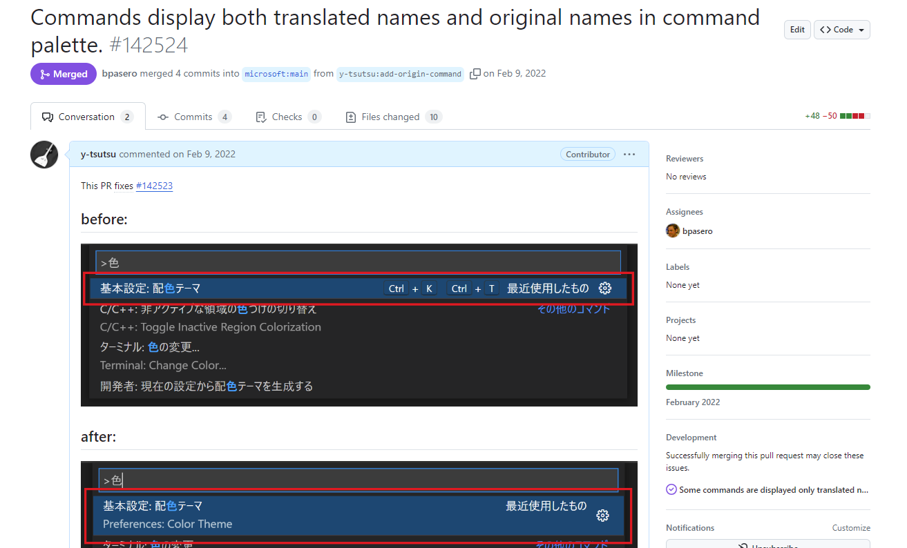
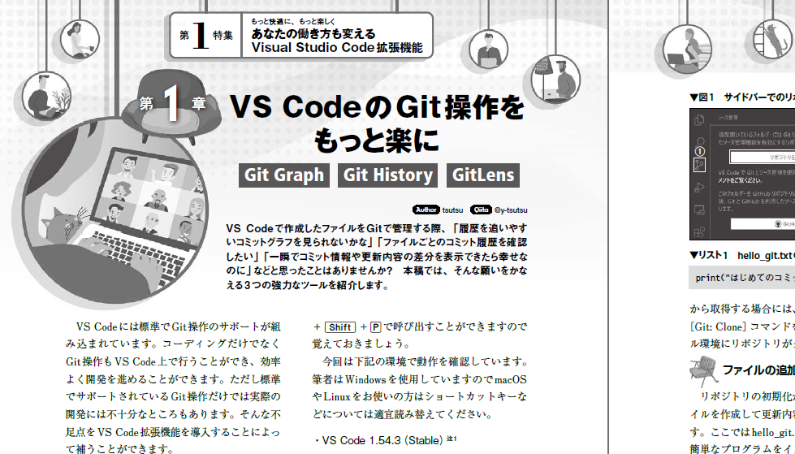
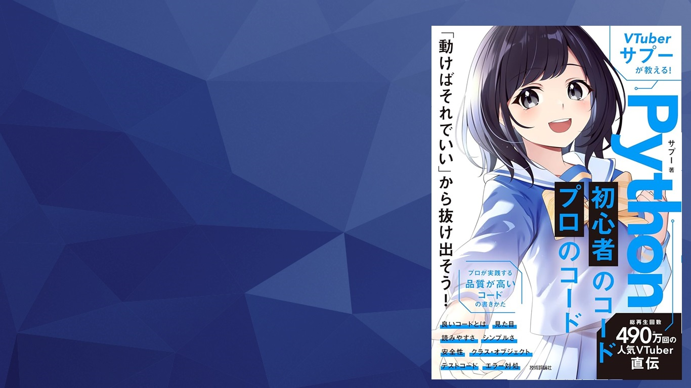

<!--
_class: lead invert
-->

# 2番目の趣味🎮

---

# About me

 

- Yusuke Tsutsumi（@tsutsu）
- エンジニア歴（20年くらい）
- エディタ大好きです
- プログラミング言語はPythonが好きです
- 技術的な文章を書くのが好きです

---

# Achievements

VS Codeへのコントリビュート 　　 技術雑誌への寄稿

　　

---

# 今日お話しすること

### 2番目の**趣味**について．．．

2番目の趣味って何でしょう？🤔🤔🤔 

---

# About me

 

- 🟩 エディタ大好きです
- ✅ **プログラミング言語はPythonが好きです**
- 🟩 技術的な文章を書くのが好きです

 

### 今日は **Python** のおすすめ書籍ついてお話をします🐍

---

# おすすめ書籍

VTuberサプーが教える！
Python 初心者のコード／プロのコード

- 自分が書いたコードは
  仕事で通用するか不安……
- 動くものは作れる
  そこからどう上達すればいい？
 

[https://gihyo.jp/book/2024/978-4-297-14285-8](https://gihyo.jp/book/2024/978-4-297-14285-8)

---

## この書籍のおすすめポイント

- サプーの中の人は（現役の？）エンジニアのようで，仕事でのコードという視点で実践的な内容が多いです
- 対象とするレベルが絶妙です．入門書と専門書のちょうど中間くらいの難易度となっています
- サンプルコードが疑似コードでなく実際に動かせるPythonで書かれています
- Pythonに限った内容ではなく，他言語にも置き換えて参考になる内容が多いです
- エラーの解消も取り扱っておりより実践的な内容となっています

---

## この書籍の目次

第1章　コードは動けばなんでも同じ？
第2章　まずはコードの見た目を整えよう
第3章　読みやすいコードに改善するテクニック
第4章　Python便利機能でシンプルなコードを書く
第5章　プロが意識する安全性が高いコードとは？
第6章　中級者への壁！ クラスとオブジェクトに慣れる
第7章　バグがあるかも？ テストコードを書こう！
第8章　自力でエラーを解消するために

🖊️ 実践的な内容が一通り網羅されています 🖊️

---

<!--
_class: lead invert
-->

### 読んでみて損はない内容かと思いますので
### 興味のある人は本屋さんで手にとってみてください📚

---

<!--
_class: lead invert
-->

## この書籍を使って会社で読書会も検討中です🖊️

 

下期あたりからたぶんやるつもりです🙄

---

<!--
_class: lead invert
-->

# Thank **You** for Reading 😀
